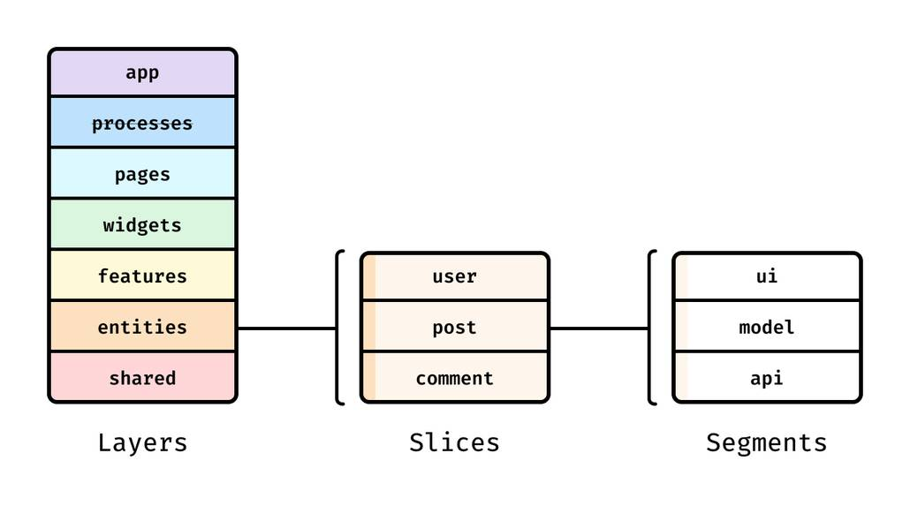

# Kursi — Feature-Sliced Design

React, TypeScript, Vite, React Compiler, Material UI, Emotion, and Tailwind CSS.

## Development

Run npm install, then npm run dev. Validate changes with npm run build and npm run lint.

## Architecture



Dependency direction: app -> processes -> pages -> features -> entities -> shared. Layers can import lower layers directly, skipping intermediate layers.

```text
src/
  main.tsx                  React bootstrap
  app/                      Composition, routing, providers
    App.tsx
    index.ts
    config/theme.ts         Material UI palette and component defaults
    styles/index.css        Global CSS, theme tokens, and Tailwind
    ui/AppHeader/           Brand and market connection display
  processes/                Reserved for multi-step workflows
  pages/home/
    index.ts                Public API
    ui/                     Market introduction, desktop table, mobile cards
    lib/                    Price formatting
  features/                 User actions, grouped into named slices
  entities/currency/        Binance transport, quote model, market-feed hook
    api/                    Browser socket adapter and message validation
    config/                 Five supported USDT pairs and timing limits
    model/                  Feed lifecycle and React subscription
    lib/                    Session percentage and tick-direction calculations
    types/                  Domain and transport contracts
  shared/                   Domain-independent UI, utilities, configuration
```

The processes layer follows the requested article and stays empty until needed.

## Current implementation

The responsive header and pale background follow the [visual reference](https://pixel-perfect-canvas-2478.lovable.app/). The implementation is written independently. The app-owned Material UI theme provides the Kursi palette, typography, breakpoints, and component defaults. The main content shares the header's 1280px container and responsive gutters.

The app starts one Binance market feed and passes its current connection status to the header and its snapshot to the home page. The feed uses a single combined WebSocket connection for BTC/USDT, ETH/USDT, SOL/USDT, BNB/USDT, and XRP/USDT. The header supports connecting, connected, reconnecting, disconnected, and error states with text and a colored indicator. Connected means a valid market update has arrived, not merely that the socket opened.

The home page shows live prices, latest-tick direction, and percentage change since opening, with a desktop table and mobile cards. Prices arrive directly from Binance; there is no mock-data fallback. Loading placeholders remain until each pair receives a valid price. Search/sorting, persistent favorites and hidden assets, conversion, and session alerts remain future work according to Take-home-assigment.docx.

The UI uses Material UI with Emotion: Box, Stack, Typography, AppBar, Card, Table, List, Avatar, Chip, Alert, Button, Tooltip, and Skeleton. It follows a light palette regardless of system theme; optional theme switching remains future work. A system sans-serif fallback is used when Inter is unavailable.

## Live market behavior

- Data source: Binance Spot's public market-data endpoint, using combined `@miniTicker` streams. The close-price field `c` supplies the latest price; Binance's 24-hour statistics are not used for session change. See the [official stream documentation](https://github.com/binance/binance-spot-api-docs/blob/master/web-socket-streams.md).
- The first valid price for each symbol becomes its session baseline. It survives reconnects and resets when the app is freshly loaded. Percentage change is `(current - initial) / initial * 100`.
- Tick arrows compare current and previous prices. An unchanged tick is neutral. Session change is calculated independently and may point in the opposite direction.
- Prices stay at full numeric precision in the model; formatting occurs only in the UI. Low-priced assets retain additional decimal places.
- Messages must contain the expected stream, event type, supported symbol, a finite positive price, and a positive integer event timestamp. Invalid messages are ignored with an error status; the next valid update clears the error. Older and duplicate timestamps do not overwrite current quotes.
- Failed connections retry after 1, 2, 4, 8, 16, then at most 30 seconds. A valid update resets the backoff. Initial connection attempts time out after 12 seconds; opened connections with no valid updates time out after 30 seconds.
- Browser offline events stop retrying and display Disconnected. Coming online reconnects automatically. A manual Retry connection button is available during errors and reconnection.
- Last-known prices remain visible during outages. Each quote is marked stale when disconnected or when it has not updated for 30 seconds. Stale quotes are informational and should not be treated as current conversion rates by future features.
- Socket handlers, retry/watchdog timers, subscriptions, and browser network listeners are cleaned up. Obsolete socket callbacks cannot change the active feed. React Strict Mode is supported.
- The application owns the feed lifecycle; the currency entity has no dependency on pages or app. The home page consumes the entity's public API.

## Rules for future implementation

- Keep static images in `public/images`. Use SVG React components from `shared/ui/icons` for UI icons, with explicit numeric `width` and `height` props on every use. Icons share `TSVGIconProps`, default to `currentColor`, and are decorative by default; the surrounding control supplies its accessible name. For example: `<SortIcon width={15} height={15} />`. The public `sort.svg` is a standalone static version; UI code uses the typed component.
- Slices on the same layer remain independent. Compose separate features in a page or higher layer.
- Expose each slice through index.ts. Consumers import the public API, never another slice's internal files.
- Within a slice, use direct relative imports rather than its own barrel. The project currently uses relative paths; no aliases are configured.
- Add segments such as ui, model, api, lib, and types only as needed. App and shared are organized by technical purpose rather than business slices.
- Keep page-specific assets and styles in the page. Keep global styles and the Tailwind import in app/styles/index.css.
- Keep functionality local to its page until extraction has a concrete benefit. Do not add empty components, services, or stores.
- For example, currency conversion belongs in features/convert-currency; a currency domain model belongs in entities/currency; a generic button belongs in shared/ui/button.
- Use Material UI components for interface elements and layout. Use Tailwind className utilities for styling instead of sx or inline styles, preserving semantic elements through component props. StyledEngineProvider places MUI styles in the mui CSS layer, before Tailwind utilities, so classes override component defaults without !important. Shared palette and typography defaults remain in the MUI theme. Keep the Tailwind import for existing global styles.
- Follow the naming, types, import ordering, JSX, and comment conventions in ../rule.md.

## Verification

ESLint restricts upward imports with path patterns. Same-layer isolation and public API boundaries also require review; lint is not a complete dependency graph validator.

Run npm run test:lint after lint rule changes. Run npm run docs:lint after lint configuration changes to regenerate ../rule.md.

Run `npm run test:market` for deterministic parser, session-price, out-of-order-message, reconnection/backoff, timeout, offline/retry, and cleanup tests. These use controlled sockets and timers without depending on external market movement. Browser smoke checks should also confirm all five real prices update and that desktop and mobile layouts remain readable.
